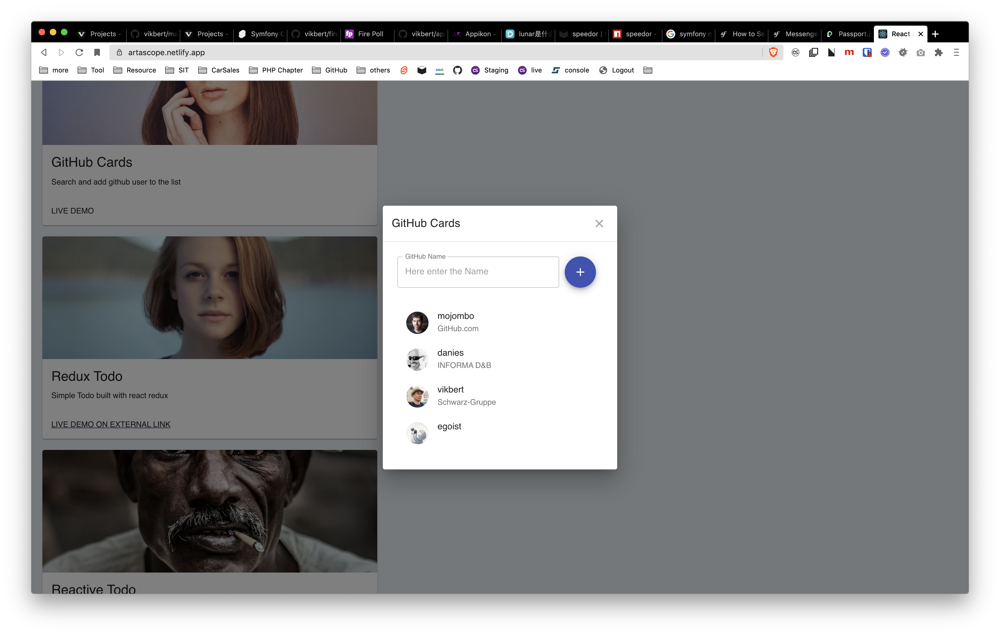

# 每天记录一个点子

## symfony training 
> 2021-03-05 

- symfony RESTful API
- react with SSR

## Code tinder
> 2021-02-11

show a code snippet as Card, then the user can click ❌ or ✅
to vote the code, or add the comment to apply the comment to the snippets.

- Vote the card
- subscribe the tinder, if the new code snipptes need to be reviewed
- ranking the most best code 
- ranking the most bad code

## GitHub Avatar bookmarker
> 2021-02-10

bookmark the github avatar

## svelte + weui
> 2021-02-07

开发介于weui和svelte的移动开发UI组建。 起点基于另外一个开源
<https://github.com/vikbert/svelte-wx-ui>

## write a svelete package for code editor with highlighting
> 2021-02-01

see 
https://medv.io/codejar/

## Checklist App
> 2020-01-13

- 九宫格选择checklist list
- 点击后进入checklist detail
  -  排序
  -  删除
  -  添加
  -  设为已完成
  -  reset all

##  life calendar
> 2019-07-07

如果我们把每一天都填充成一个格子，同时我们假定自己能够活到80岁，那么我们可以利用的时间，就是非常有限和可见的。
将所剩下的天数图形化。

## Markdown => 日程表
> 2019-05-23 

使用 markdown 定义今天会议的流程，让后自动生成今天的时间安排表。

- 时间日程列表
- 自动滚动的时间轴
- 可以查看单个 event 的具体信息

🔥[**GitHub**] markdonw timeline format and toolkit  
<https://github.com/azu/mdline>

🔥[**Article**] schedule template  
<https://codyhouse.co/gem/schedule-template>

##  团队内部的图书管理
> 2019-05-23

创建一个非常极简的借书程序，用于管理现有的书籍。可以包括一下功能：

- 书籍列表
- 列出借书信息
- 预约一本书
- 邮件提醒，如果书本到期或者已经归还

## 创客少儿编程
> 2019-05-22 

青少年编程创客： 出售一些和创客相关的小硬件，面向的客户群体是青少年。 例如，可以编程的灯具，可以编程的机器人。德国市面上可以购买到的类似产品的相对价格较高。
如果有类似的产品代替，并且有相应的价格优势的话，或许可以去尝试一下。

## 约餐小程序
> 2019-05-21 

每到中午时间，同事都会因为午餐去哪里吃为难。通常的方法是，一位同事在 chat 中，发送一个想去的餐馆，看看有哪些同事愿意同往。通常，同事间会互相询问，餐馆的
菜单，口味，价格等等。可以开发一个约餐小程序，提供以下简单功能：

- 餐馆的列表
- 创建一个约餐，里面最多可以选择三个餐馆以供选择，要加上一个截止日期
- 当接到约餐的邀请后，可以在里面选择 1-2 个
- 截止时间到以后，预约将会显示最终结果。

## 实时投票
> 2019-05-20

发布者可以发布一个建议，以及备用选项。当此建议被发布以后，所有拿到此链接的人都可以投票表决，所有表决的票数会`实时`的以`图标`的形式显示出来。
